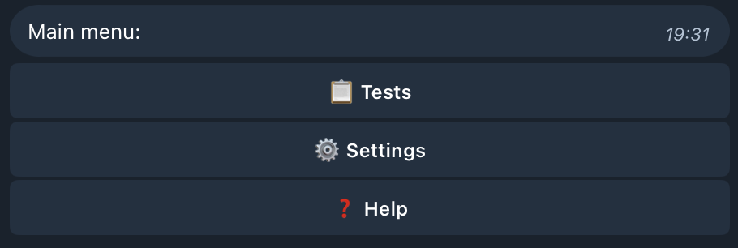
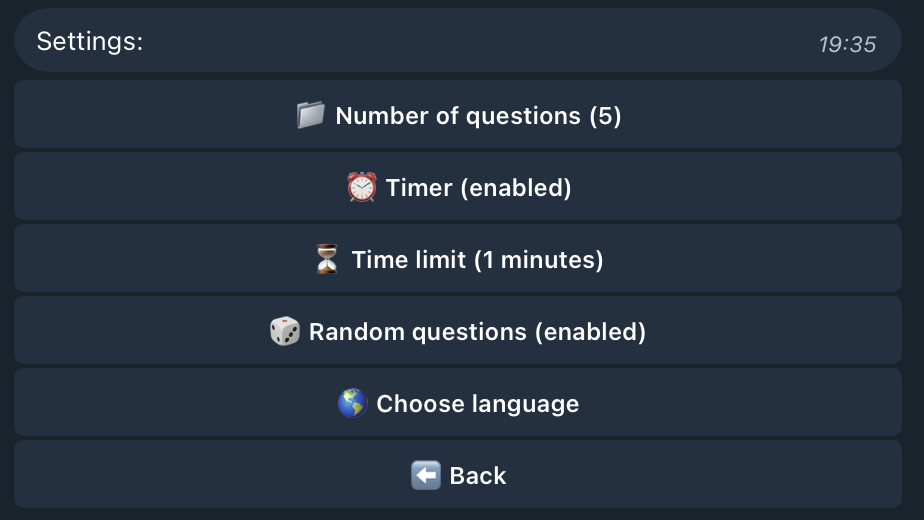
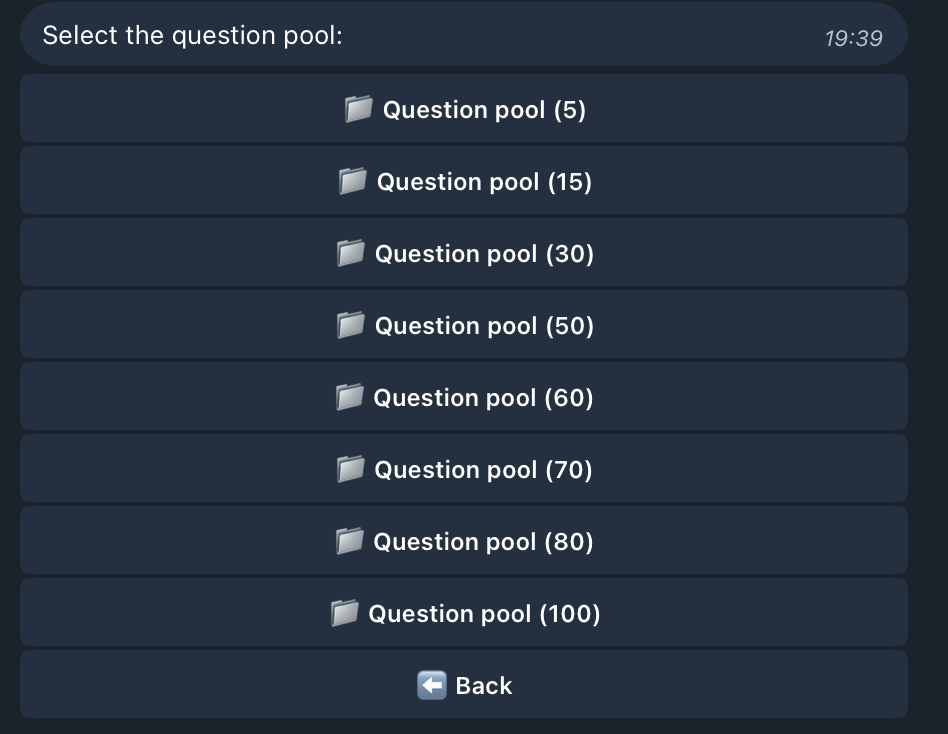
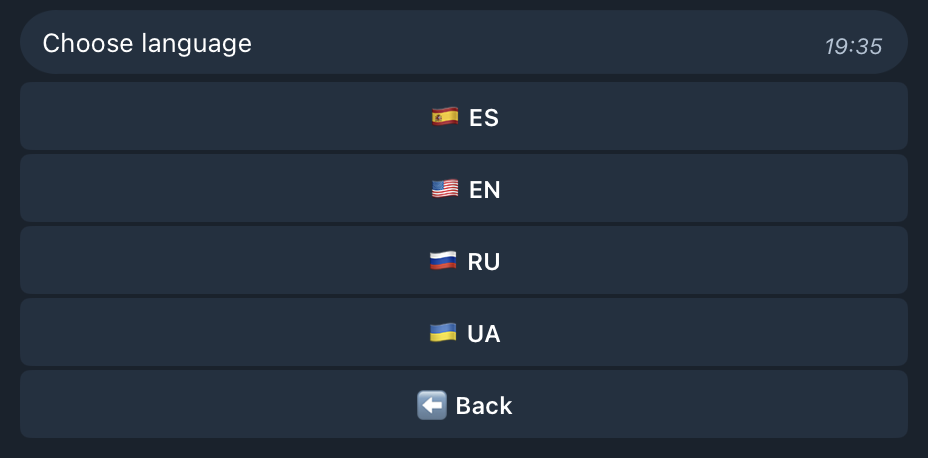
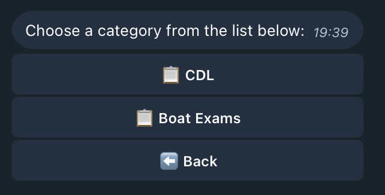
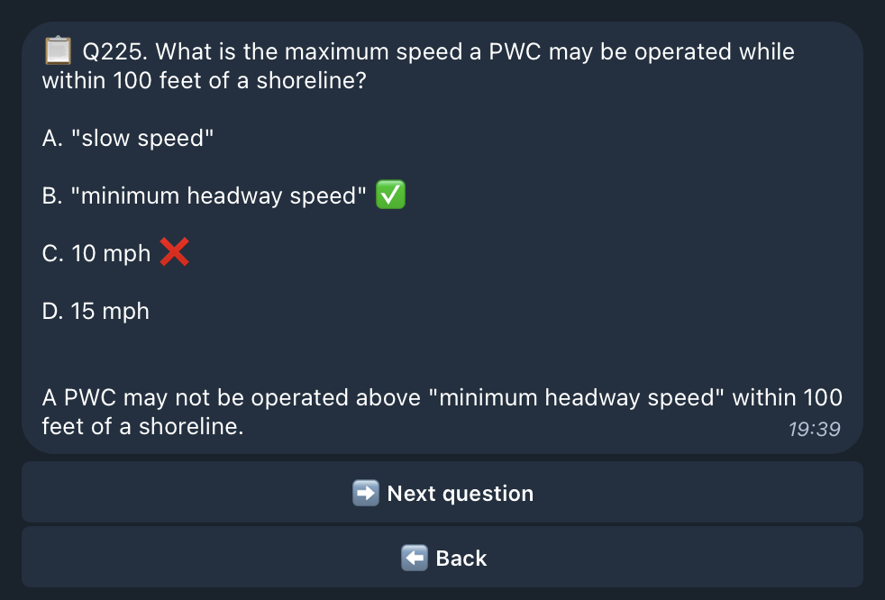

# QuizBoutiqueBot
[](https://www.buymeacoffee.com/skysoulkeeper)

## 1. Overview
QuizBoutiqueBot is a versatile Telegram bot designed for conducting quizzes with various settings and customizations. It offers a comprehensive user experience with features like timer support, question randomization, and localization in multiple languages.

- **Latest Stable Version:** [Main Branch](https://github.com/skysoulkeeper/QuizBoutiqueBot/tree/main)
- **Latest Changes:** [Develop Branch](https://github.com/skysoulkeeper/QuizBoutiqueBot/tree/develop)
- **Test Question Pools:**
  - [Boating License EN (NJ)](data/questions/Boat%20Exams/NJ%20Boat%20Exam%20Answers%20EN.json)
  - [Boating License RU+EN (NJ)](data/questions/Boat%20Exams/NJ%20Boat%20Exam%20Answers%20RU+EN.json)
  - [BSIS EN (CA Powers to Arrest)](data/questions/BSIS/CA%20Powers%20to%20Arrest%20EN.json)
  - [CDL RU (General Knowledge)](data/questions/CDL/General%20Knowledge%20RU.json)


## Table of Contents
1. [Overview](#1-overview)
2. [Visual Demo](#2-visual-demo)
3. [Features](#3-features)
4. [Installation](#4-installation)
5. [Creating Your Telegram Bot and Adding to a Group](#5-creating-your-telegram-bot-and-adding-to-a-group)
6. [Usage](#6-usage)
7. [How It Works](#7-how-it-works)
8. [Adding Your Own Quizzes](#8-adding-your-own-quizzes)
9. [Customization](#9-customization)
10. [Advanced Configuration](#10-advanced-configuration)
11. [Detailed Description of Files and Functionality](#11-detailed-description-of-files-and-functionality)
12. [To Do or Not To Do](#12-to-do-or-not-to-do)
13. [Development and Contribution](#13-development-and-contribution)
14. [Acknowledgments](#14-acknowledgments)
15. [License](#15-license)
16. [Contact](#16-contact)
17. [Support](#17-support)
18. [Disclaimer](#18-disclaimer)

## 2. Visual Demo
|  |  |  |
|------------------------|------------------------|------------------------|
|  |  |  |

## 3. Features
- **Quiz Timer Functionality:**
  - Enable or disable a timer for quizzes.
  - Customizable timer limits (in minutes).
  - Automatic submission of the quiz when time runs out, displaying results.

- **Randomization of Questions:**
  - Option to randomize the order of questions.
  - Provides a unique experience each time the quiz is taken.

- **Question Categories and Management:**
  - Support for multiple quiz categories for better organization.
  - Easy navigation through categories to select specific quizzes.

- **Detailed Results and Explanations:**
  - Users receive detailed results showing correct and incorrect answers.
  - Explanations for answers are provided when available to enhance learning.

- **User Settings and Preferences:**
  - Customize settings such as:
    - Number of questions per quiz.
    - Timer status (enabled/disabled).
    - Timer limits.
    - Randomization of questions.
  - Settings are saved per user, providing a personalized experience.

- **Localization Support:**
  - Multi-language interface with easy language switching.
  - Currently supports languages: [🇺🇸 English](locales/en.yml), [🇪🇸 Spanish](locales/es.yml), [🇷🇺 Russian](locales/ru.yml), and [🇺🇦 Ukrainian](locales/ua.yml).
  - Easy to add additional languages via localization files.

- **Persistent Data Handling:**
  - Remembers user settings and the last quiz taken.
  - Users can restart the last quiz with a single command.

- **Interactive Menus with Inline Keyboards:**
  - Intuitive navigation using inline keyboard buttons.
  - Users can easily navigate menus and select options without typing commands.

- **Error Handling and User Feedback:**
  - Informative error messages guide users in case of unexpected inputs.
  - Robust handling of exceptions ensures a smooth user experience.

- **Proxy Support:**
  - Configure and use proxy settings for secure and anonymous connections.

## 4. Installation

**[Docker Deployment Guide](docker/DOCKER.md)** - Complete guide for containerized deployment

Get your computer ready to run the bot. Simple step-by-step instructions for Windows, macOS, and Linux.

1) Install Python (version 3.8 or later)
- Windows:
  - Go to https://www.python.org/downloads/windows/ and download the latest Python 3.x (Download Python 3.x).
  - In the installer, check "Add Python to PATH", then click Install Now.
  - How to open a terminal: press Win and type "Command Prompt" (or "PowerShell"), then open it.
  - Verify installation: run `python --version` or `py --version`.

- macOS:
  - Go to https://www.python.org/downloads/macos/ and download the pkg installer for Python 3.x. Install it.
  - Alternative for advanced users: Homebrew - `brew install python`.
  - How to open a terminal: open Spotlight (Cmd+Space), type "Terminal", then open the Terminal app.
  - Verify: `python3 --version`.

- Linux:
  - How to open a terminal: usually Ctrl+Alt+T or find "Terminal" in the menu.
  - Install Python and pip (choose your distro):
    - Ubuntu/Debian: `sudo apt update && sudo apt install -y python3 python3-pip`
    - Fedora: `sudo dnf install -y python3 python3-pip`
    - Arch: `sudo pacman -S python python-pip`
  - Verify: `python3 --version`, `pip3 --version`.

2) Get the project

Install Git (only if you choose Option A):
- Windows: download and install Git for Windows from https://git-scm.com/download/win. During setup, choose "Use Git from the command line and also from 3rd-party software". Open Git Bash or Command Prompt.
- macOS: install Xcode Command Line Tools: `xcode-select --install`, or use Homebrew: `brew install git`.
- Linux:
  - Ubuntu/Debian: `sudo apt update && sudo apt install -y git`
  - Fedora: `sudo dnf install -y git`
  - Arch: `sudo pacman -S git`
Verify: `git --version` should print a version number.


- Option A (git):
```bash
git clone https://github.com/skysoulkeeper/QuizBoutiqueBot.git
cd QuizBoutiqueBot
```
- Option B (ZIP): click "Code" -> "Download ZIP" on the repository page, unzip it and open the unzipped folder in your terminal.
- Important: from now on, run all commands in the project folder that contains `app.py` and `requirements.txt`.

3) (Optional but recommended) Create a virtual environment
- Windows:
  ```bash
  py -3 -m venv .venv
  .venv\Scripts\activate
  ```
- macOS/Linux:
  ```bash
  python3 -m venv .venv
  source .venv/bin/activate
  ```
If you see `(.venv)` at the start of your terminal line, it's active.

4) Install dependencies
- Run one of these (depending on your system):
  ```bash
  pip install -r requirements.txt
  # if pip is not found:
  python -m pip install -r requirements.txt
  # or on Linux/macOS:
  pip3 install -r requirements.txt
  ```
If you see permission errors - add `--user` (Linux/macOS) or make sure the virtual environment is activated.

## 5. Creating Your Telegram Bot and Adding to a Group
Step-by-step guide to create your Telegram bot and use it in DMs or groups.

1) Create a bot with BotFather
- Open Telegram and find the official @BotFather.
- Send `/newbot` and follow the prompts:
  - Choose a display name.
  - Choose a unique username ending in `bot` (e.g., `MyQuizBoutiqueBot`).
- BotFather will give you a token like `123456789:ABC...`. Save it and put it into `configs/config.yml` as `telegram.token`.

2) (Optional) Turn off "Group Privacy" for group usage
- In @BotFather open `/mybots` -> choose your bot -> Bot Settings -> Group Privacy -> Turn Off.
- Why: with privacy off, the bot can see commands and button presses in groups, which is useful for quizzes.

3) Add the bot to your group
- Open your group -> Add member -> search your bot by username -> add.
- Grant admin rights only if you know you need them. The quiz UI works with inline buttons and /start.

4) Find your group chat_id (optional)
- If you want to save the group chat_id in config, the easiest way is to add @getidsbot or @RawDataBot to the group. They will show the chat ID.
- Optionally set `telegram.chat_id` in `configs/config.yml`. It is optional. The bot works without it.

5) Paste the token in config and run
- Open `configs/config.yml`, set `telegram.token` and, if needed, configure `proxy_settings`.
- Start the bot and send `/start` in DM or in the group. See Usage below.


## 6. Usage
Step-by-step instructions to run and use the bot, even if you've never run programs before.


1) Configure the bot (configs/config.yml)
- Open `configs/config.yml` with any text editor (e.g., Notepad on Windows, TextEdit on macOS, nano/gedit on Linux).
- Find the `telegram` section and set:
  - `token`: paste your bot token from BotFather (see "Creating Your Telegram Bot" below).
  - `language`: interface language - `en`, `es`, `ru`, `ua` (you can also switch inside the bot).
  - `proxy_settings`: if Telegram is restricted in your region, enable and configure a proxy (see example below and "Advanced Configuration").
  - You can keep the rest at defaults (you can always change them later in "Settings").

2) Start the bot
- Windows:
  ```bash
  py app.py
  # if that doesn't work, try:
  python app.py
  ```
- macOS/Linux:
  ```bash
  python3 app.py
  # with an active virtual environment this also works:
  python app.py
  ```
If it worked, the terminal will show a startup message and your bot will be online in Telegram.

3) Open Telegram and try it
- Find your bot by its username (set in BotFather) and press "Start" (/start).
- Main menu:
  - "Tests" - choose a category and a quiz (questions are read from `data/questions`).
  - "Settings" - adjust the number of questions, timer, time limit, random order, and language.
  - "Help" - quick help.
- For groups: add the bot to a group, optionally turn off "Group Privacy" in BotFather (see next section), send /start in the group - members can take quizzes right there.

4) Stop the bot
- Go back to the terminal where the bot is running and press Ctrl+C.


## 7. How It Works
- **Configuration Loading:**
  - On startup, the bot loads configurations from [config.yml](configs/config.yml), including settings for logging, proxies, directories, and Telegram.

- **Initialization:**
  - Initializes directories, sets up logging, proxy settings, and loads localization files.

- **Command Handlers:**
  - Handles various commands like /start, and button presses using command handlers defined in the code.

- **Quizzes:**
  - Users can select categories and quizzes, which are loaded from JSON files in the specified directories. Questions can be randomized if enabled.

- **Timer:**
  - If the timer is enabled, users must complete the quiz within the specified time limit.

- **Question Pools:**
  - The question pools are located in the data/questions directory.

## 8. Adding Your Own Quizzes
It's easy: the bot reads files from `data/questions` and automatically shows them under "Tests".

1) Structure and format
- Each quiz is a JSON file (UTF-8) placed inside a category subfolder, e.g., `data/questions/Boat Exams/NJ Boat Exam Answers EN.json`.
- Each file is a list of question objects with fields:
  - `question` - the question text.
  - `answers` - list of answer options (strings). Recommended to start each option with a short key and a separator, e.g., `A. ...`, `B. ...` or `A: ...`, `B: ...`. Numbers like `1. ...` also work.
  - `correct_answer` - the exact string from `answers` that is correct (the key and text must match exactly).
  - `explanation` (optional) - an explanation that is shown after answering.
- Telegram button labels have a length limit. In code `MAX_BUTTON_LENGTH` is 64. Keep a short key at the start (`A.`, `B.` etc.) and the long text after it.

Example:
```json
[
  {
    "question": "What is the capital of France?",
    "answers": ["A. Berlin", "B. Paris", "C. Rome", "D. Madrid"],
    "correct_answer": "B. Paris",
    "explanation": "Paris is the capital and most populous city of France."
  },
  {
    "question": "Which planet is known as the Red Planet?",
    "answers": ["A. Earth", "B. Mars", "C. Jupiter", "D. Venus"],
    "correct_answer": "B. Mars",
    "explanation": "Mars is often called the 'Red Planet' because of its reddish appearance."
  }
]
```

Tips
- Categories are subfolders in `data/questions` (e.g., `CDL`, `Boat Exams`, `BSIS`). Folder names appear in the menu.
- Use clear filenames ending with `.json`.
- You can mix languages in one file (see `NJ Boat Exam Answers RU+EN.json`). The structure must remain valid.
- Validate your JSON in any online validator if the bot reports a format error.

Add/update quizzes
- Copy your JSON file into the appropriate subfolder inside `data/questions`.
- Restart is not required - the list is read dynamically. If you don't see the new quiz immediately, open "Tests" again.

## 9. Customization
**Emojis and Icons**
- The bot uses emojis and icons for a better user experience.
- Emojis can be customized in the [config.yml](configs/config.yml) file under the emoji section.

**Example:**
```yaml
emoji:
  test: "📝"
  timer: "⏱️"
  enabled: "✅"
  disabled: "❌"
  back_button: "🔙"
  settings: "⚙️"
  help: "❓"
  language: "🌐"
```

**Localization Files**

- Adding New Languages:
  - Localization files are stored in the locales directory as YAML files.
  - To add a new language, create a new YAML file with the language code, e.g., fr.yml for French.
- Translating Strings:
  - Provide translations for each key present in other localization files.
  - Ensure that all required keys are included to prevent missing text in the bot.

## 10. Advanced Configuration
- Proxy Support

  - If you need to use a proxy:

      1.	Enable Proxy in [config.yml](configs/config.yml):
    ```yaml
    proxy_settings:
      proxy_enabled: False                              # Enable or disable proxy usage
      proxy_host: ""                                    # Proxy server IP address or hostname
      proxy_port: 1080                                  # Proxy server port number
      proxy_protocol: "socks"                           # Proxy protocol (e.g., "http", "https", "socks")
      proxy_username: ""                                # Username for proxy authentication
      proxy_password: ""                                # Password for proxy authentication
    ```

    2.	Supported Proxy Types:
    - HTTP, HTTPS, SOCKS4, and SOCKS5 proxies are supported.

## 11. Detailed Description of Files and Functionality
### 1. [app.py](app.py)
- Entry point of the application.
- Initializes the bot by loading configurations, setting up logging, proxies, and starting the Telegram bot.

### 2. [utils/initializer.py](utils/initializer.py)
- Contains the `Loader` class, which initializes the application by loading configurations, setting up logging, directories, and proxy settings.

### 3. [utils/logger.py](utils/logger.py)
- Manages logging configurations using either the `loguru` or Python's built-in logging module.

### 4. [utils/proxy.py](utils/proxy.py)
- Manages proxy settings and handles setting up and testing proxy connections.

### 5. [utils/localization.py](utils/localization.py)
- Manages localization by loading translations from YAML files and providing translated strings.

### 6. [modules/telegram/handlers.py](modules/telegram/handlers.py)
- Defines the `BotHandler` class, which manages bot interactions and handles commands and button presses.

### 7. [modules/telegram/settings.py](modules/telegram/settings.py)
- Handles settings management including the number of questions, timer settings, and random question order.

### 8. [modules/telegram/menus.py](modules/telegram/menus.py)
- Defines functions to show various menus to the user, such as the main menu, settings menu, and quiz categories.

### 9. [modules/telegram/quizzes.py](modules/telegram/quizzes.py)
- Manages quiz operations including loading quiz files, sending questions, and handling quiz responses.

### 10. [configs/config.yml](configs/config.yml)
- Configuration file containing settings for the bot including environment, directories, logging, proxy, and Telegram settings.

### 11. [locales/en.yml](locales/en.yml)
- Localization file for English, containing translated strings for bot interactions.

## 12. To Do or Not To Do
- Implement cflags functionality.
- Process lists from CSV, XLS, DOC.
- Add tests.
- Code and project structure optimization.
- Implement asynchronous processing for faster results.
- Develop a WebUI.
- Database support with import and export.

However, these enhancements might be considered in the future or perhaps in another lifetime.

## 13. Development and Contribution
### Development
- **Testing Environments:**
  - Tested on Windows and macOS with Python version 3.11.
- **Purpose:**
  - Created in free time to make studying tests more convenient.

### Contributing
We welcome contributions! Here's how you can help:

- **Reporting Issues:**
  - Open an issue on GitHub if you find bugs or have feature requests.
- **Pull Requests:**
  - Fork the repository, make your changes, and submit a pull request.
  - Ensure your code follows the existing style and includes docstrings and comments.
- **Adding Quizzes:**
  - You can contribute by adding new quiz files in the appropriate category.

## 14. Acknowledgments
- **Libraries Used:**
  - **python-telegram-bot** for interacting with the Telegram Bot API.
  - **requests** for making HTTP requests.
  - **loguru** for advanced logging capabilities.
  - **PyYAML** for parsing YAML files (used in configuration and localization).
  - **watchdog** for monitoring file system events.
- **Inspiration:**
  - Inspired by the need for an interactive and customizable quiz platform on Telegram.
- **Special Thanks:**
  - Thanks to the [python-telegram-bot](https://python-telegram-bot.org/) community for their support.

## 15. License
This project is licensed under the [MIT License](LICENSE). See the `LICENSE` file for details.

## 16. Contact
For any questions or support, please contact:
- **Email:** [skysoulkeeper@gmail.com](mailto:skysoulkeeper@gmail.com)

## 17. Support
If you like this project and want to support its development, consider buying me a coffee:

[](https://www.buymeacoffee.com/skysoulkeeper)

You can also support via:
- **PayPal 💸:** [Donate via PayPal](https://www.paypal.com/donate/?business=RC5EDUDFBPNCJ&no_recurring=0&currency_code=USD)
- **USDT (ERC20) 🪙:** `0xE157B1Ae65ee66B0c98D87829dC03f84DcfDed2d`
- **USDT (BEP20) 🪙:** `0xE157B1Ae65ee66B0c98D87829dC03f84DcfDed2d`
- **USDT (TRC20) 🪙:** `TAa9C6i8XYapJ1YsUZDxM5kyYiQ8YbL1TU`
- **BTC ₿:** `bc1qmkxklzc66tj0s3qzyww2jl9h5ul3a5mttlvylt`
- **ETH Ξ:** `0xE157B1Ae65ee66B0c98D87829dC03f84DcfDed2d`
- **DOGE 🐕:** `D5bsqM2dCSJpvS5XWy8RLHCmymwBYFZcan`

## 18. Disclaimer
This bot is provided as-is. Feel free to download, modify, and use it as you see fit.

---
